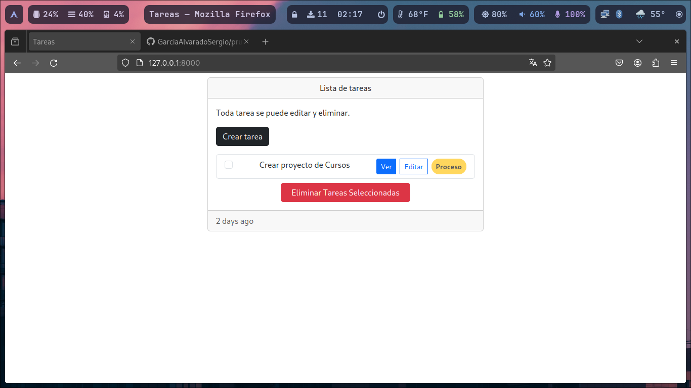

## Prueba tecnica

Pasos para ejecutar proyecto:

1.- **composer install**

2.- **cp .env.example .env**

3.- **php artisan key:gene**

4.- **php artisan config:cache**

5.- **php artisan config:clear**

6.- **php artisan cache:clear**

